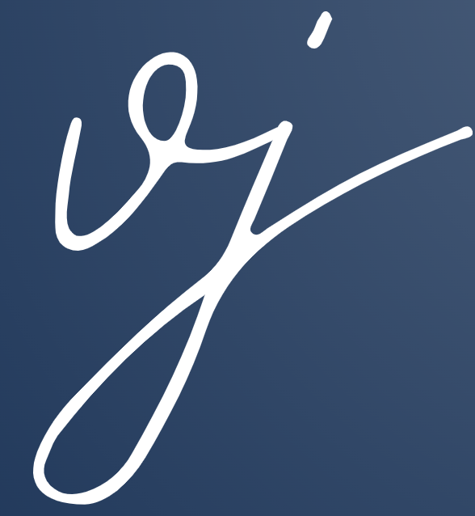

[![MIT License][license-shield]][license-url]
[![LinkedIn][linkedin-shield]][linkedin-url]

<!-- SergiVJ LOGO -->
 

  

  <h3 align="center">Blog | Django REST API & React</h3>

  

    Blog creado con Django REST API en Arquitectura Hexagonal (DDD) y ReactJS para el Frontend
     
  

<!-- ABOUT THE PROJECT -->
## Sobre el proyecto

La finalidad del proyecto creado, era implementar una arquitectura hexagonal en un proyecto utilizando Django para el backend y React.js para el frontend. Esta estructura modular mejoró la mantenibilidad y permitió una separación clara entre la lógica del negocio y la interfaz de usuario, proporcionando una experiencia de desarrollo más eficiente.

Entre otras cosas, destaca por: 
* Arquitectura Hexagonal
* Lógica separada
* Escalabilidad

### Desarrollado con

Las tecnologías en las que nos hemos apoyado, han sido principalmente:

* [![React][React-img]][React-url]
* [![Bootstrap][Bootstrap-img]][Bootstrap-url]
* [![Django][Django-img]][Django-url]
* 

<!-- LICENSE -->
## Licencia

Distributed under the MIT License.

<!-- CONTACT -->
## Contacta conmigo

Sergi Villa - me@sergivj.com

[My Linkedin][linkedin-url]

[My Portfolio][portfolio-url]

[license-shield]: https://img.shields.io/github/license/othneildrew/Best-README-Template.svg?style=for-the-badge
[license-url]: https://github.com/othneildrew/Best-README-Template/blob/master/LICENSE.txt
[linkedin-shield]: https://img.shields.io/badge/-LinkedIn-black.svg?style=for-the-badge&logo=linkedin&colorB=555
[linkedin-url]: https://linkedin.com/in/sergivj
[portfolio-url]: http://sergivj.com

[django-url]: https://linkedin.com/in/sergivj
[Django-img]: https://img.shields.io/badge/DJANGO-REST-ff1709?style=for-the-badge&logo=django&logoColor=white&color=gray&labelColor=black
[Bootstrap-img]: https://img.shields.io/badge/Bootstrap-563D7C?style=for-the-badge&logo=bootstrap&logoColor=white
[Bootstrap-url]: https://getbootstrap.com
[React-img]: https://img.shields.io/badge/React-20232A?style=for-the-badge&logo=react&logoColor=61DAFB
[React-url]: https://reactjs.org/

